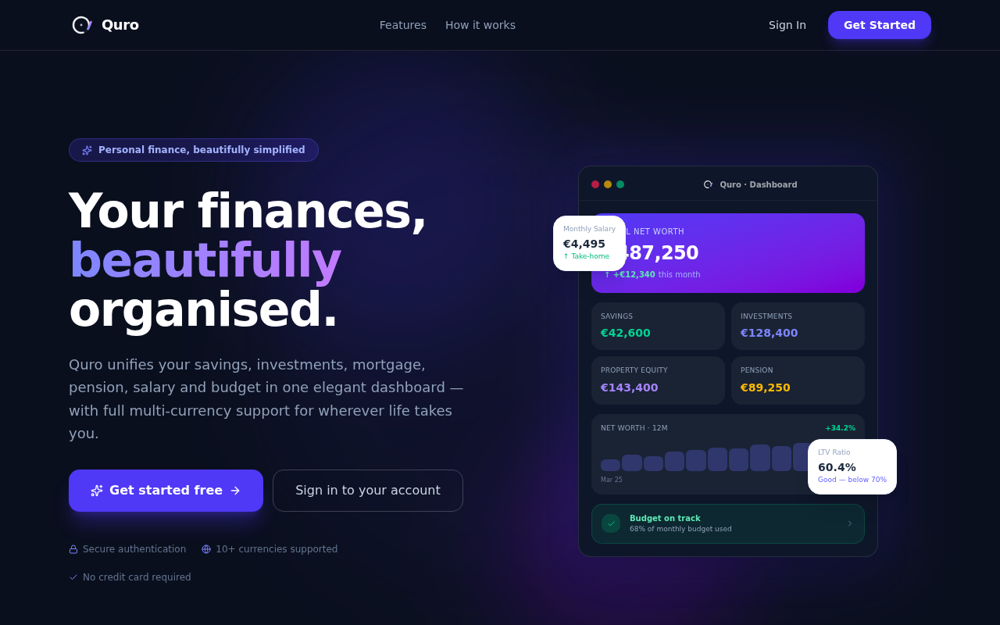
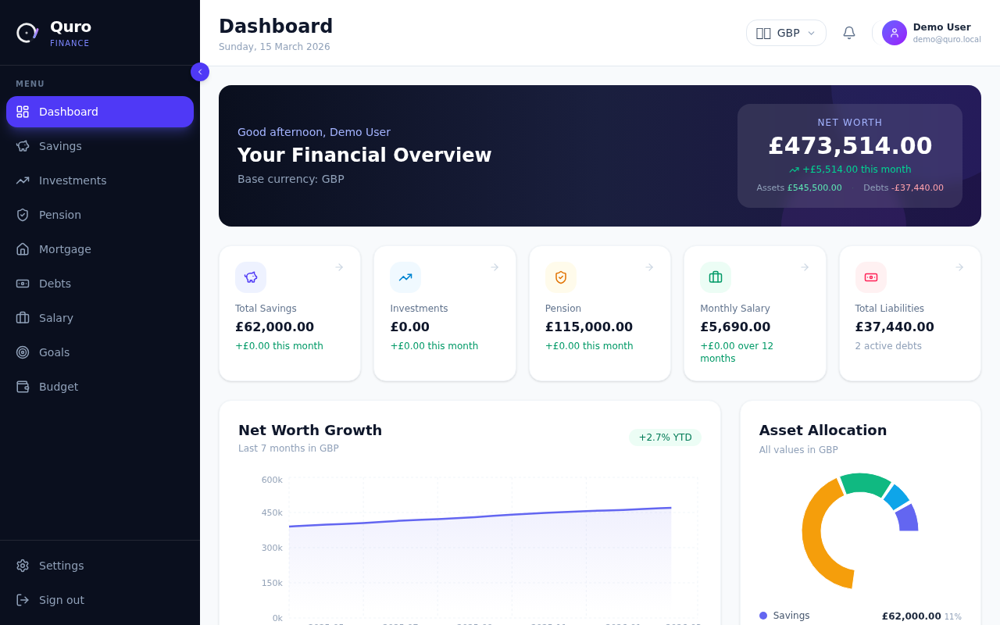
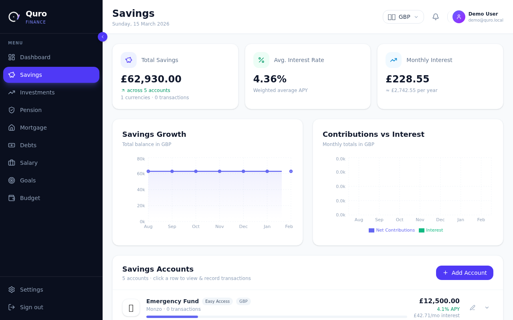
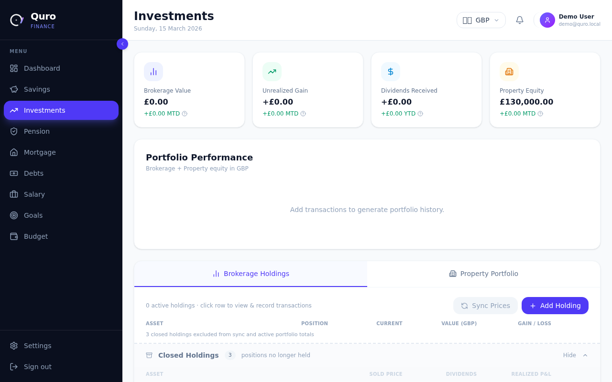
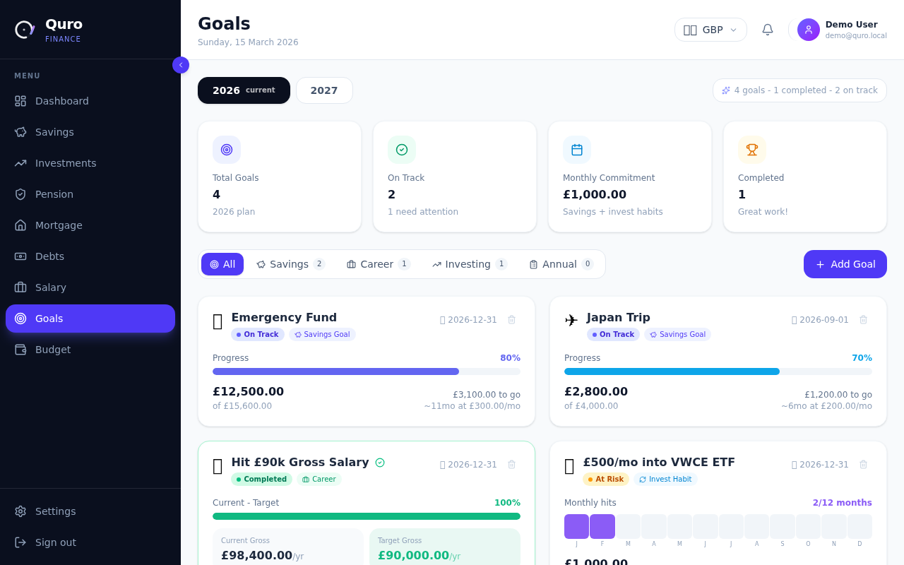
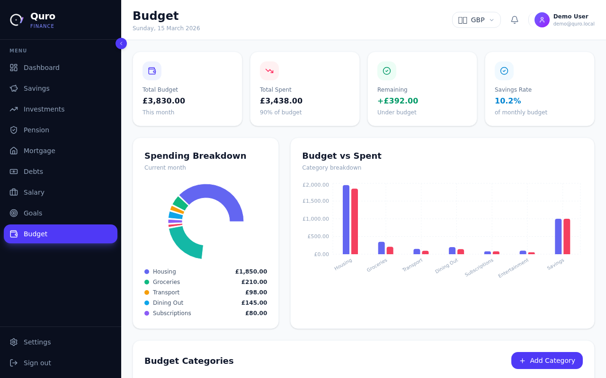
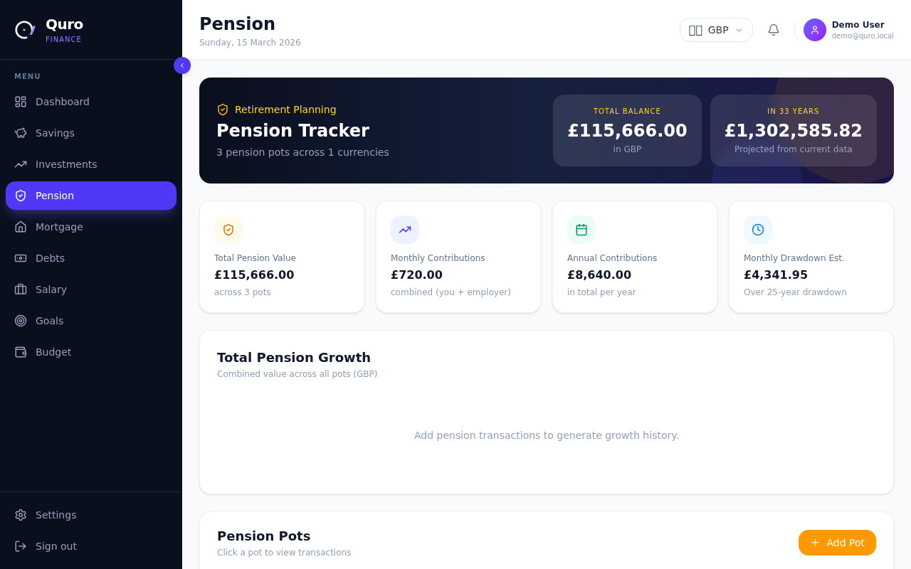
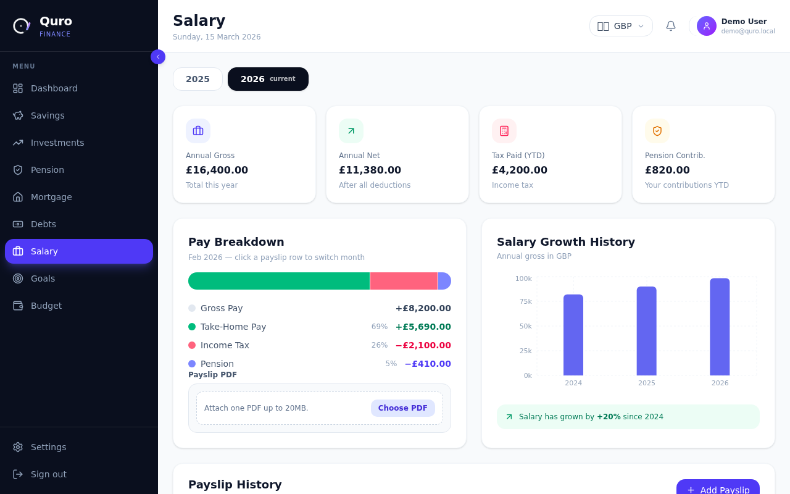
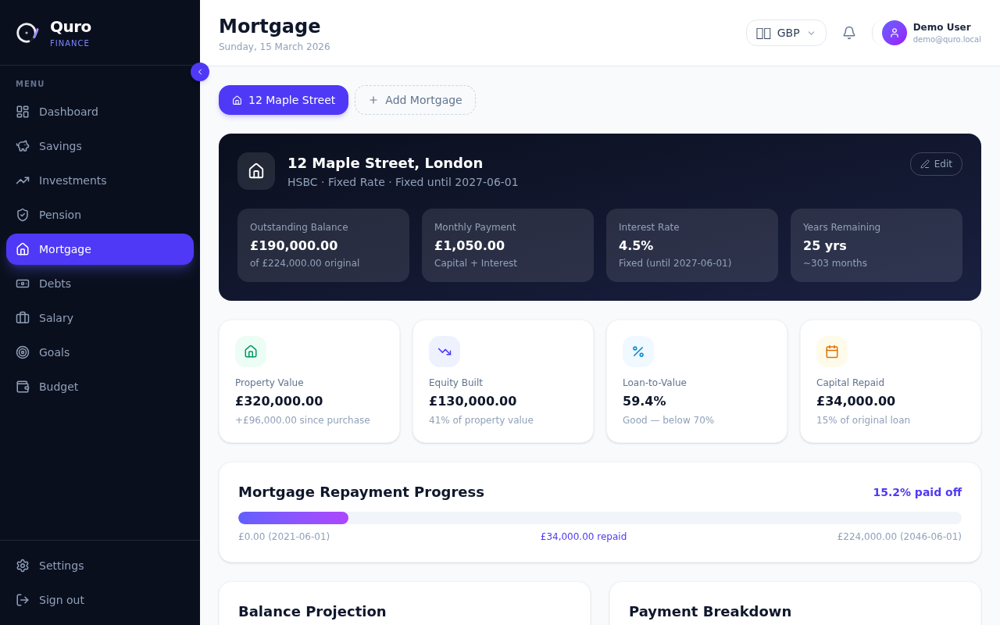
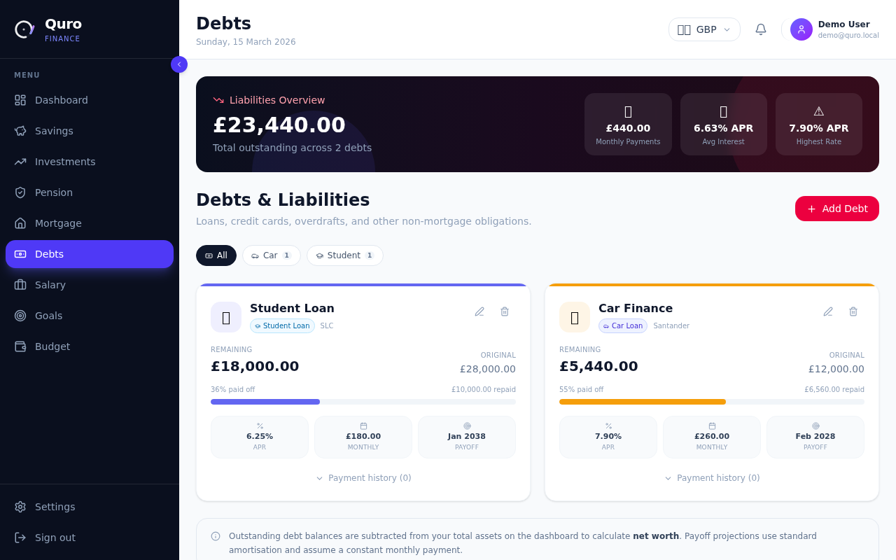

# Quro

[](https://github.com/Pieter-OHearn/quro/releases/latest)
[](https://github.com/Pieter-OHearn/quro/actions/workflows/release.yml)
[](LICENSE)
[](https://github.com/Pieter-OHearn/quro/pkgs/container/quro-frontend)

Quro is a self-hosted personal finance app that brings budgeting, savings, investing, and long-term planning into one dashboard. It tracks your salary, savings accounts, investments, pensions, and financial goals — and lets you attach supporting documents to keep everything in one place. Open source and built to run on your own hardware.

## Screenshots

<table>
  <tr>
    <td></td>
    <td></td>
  </tr>
  <tr>
    <td align="center"><em>Welcome</em></td>
    <td align="center"><em>Dashboard</em></td>
  </tr>
  <tr>
    <td></td>
    <td></td>
  </tr>
  <tr>
    <td align="center"><em>Savings</em></td>
    <td align="center"><em>Investments</em></td>
  </tr>
  <tr>
    <td></td>
    <td></td>
  </tr>
  <tr>
    <td align="center"><em>Goals</em></td>
    <td align="center"><em>Budget</em></td>
  </tr>
  <tr>
    <td></td>
    <td></td>
  </tr>
  <tr>
    <td align="center"><em>Pension</em></td>
    <td align="center"><em>Salary</em></td>
  </tr>
  <tr>
    <td></td>
    <td></td>
  </tr>
  <tr>
    <td align="center"><em>Mortgage</em></td>
    <td align="center"><em>Debts</em></td>
  </tr>
</table>

## Self-hosting

Download the `docker-compose.release.yml` from the [latest release](https://github.com/Pieter-OHearn/quro/releases/latest) — no need to clone this repository.

1. Download the release files and navigate into the directory.

2. Copy and configure the environment file and secrets:

```bash
cp .env.template .env
for file in secrets/*.example; do cp "$file" "${file%.example}"; done
```

Edit each file under `secrets/` to set your own passwords and keys.

> The investments feature (ticker lookup and price sync) requires a free [Marketstack](https://marketstack.com) API key. Sign up at marketstack.com, copy your access key, and paste it into `secrets/marketstack_api_key.txt`. The rest of the app works without it.

3. Authenticate with the GitHub Container Registry and start the stack:

```bash
docker login ghcr.io
docker compose pull
docker compose up -d
```

4. Open `http://localhost` and create your first account.

Your data is stored locally in `./data` (PostgreSQL at `./data/postgres`, documents at `./data/minio`). Back up both together:

```bash
# Create a PostgreSQL dump
docker compose run --rm db-tools backup

# Back up document storage (pension PDFs, payslips)
rsync -av ./data/minio/ /path/to/backup/minio/
```

Dumps are written to `./backups/db`. To restore:

```bash
docker compose stop backend
docker compose run --rm \
  -e QRO_RESTORE_CONFIRM=restore-db \
  -e QRO_RESTORE_ALLOW_NON_EMPTY=1 \
  db-tools restore /backups/db/<dump-file>.dump
docker compose up -d backend
```

Restore MinIO by copying your `./data/minio` backup back in place before starting the backend. The DB dump and MinIO snapshot must be from the same point in time.

## Contributing

See [docs/development.md](docs/development.md) for the local development setup and [CONTRIBUTING.md](docs/CONTRIBUTING.md) for the release process.

Install the pre-commit hook before your first commit:

```bash
brew install gitleaks
bun run hooks:install
```

## License

[MIT](LICENSE)
