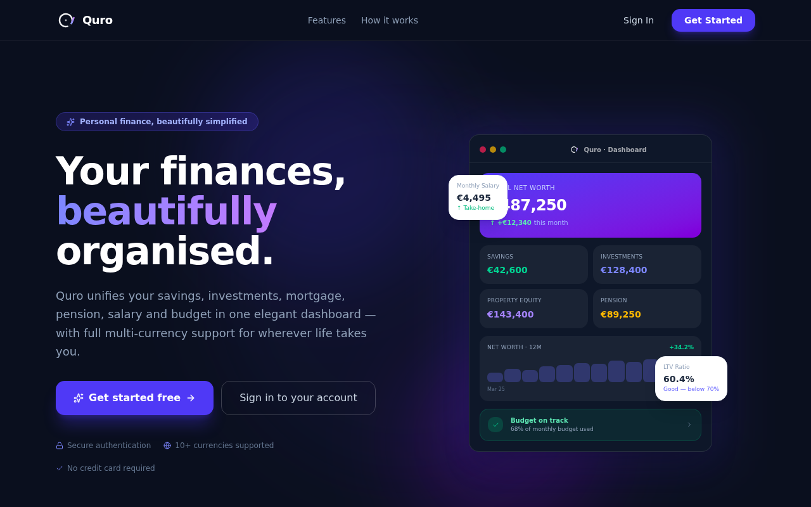
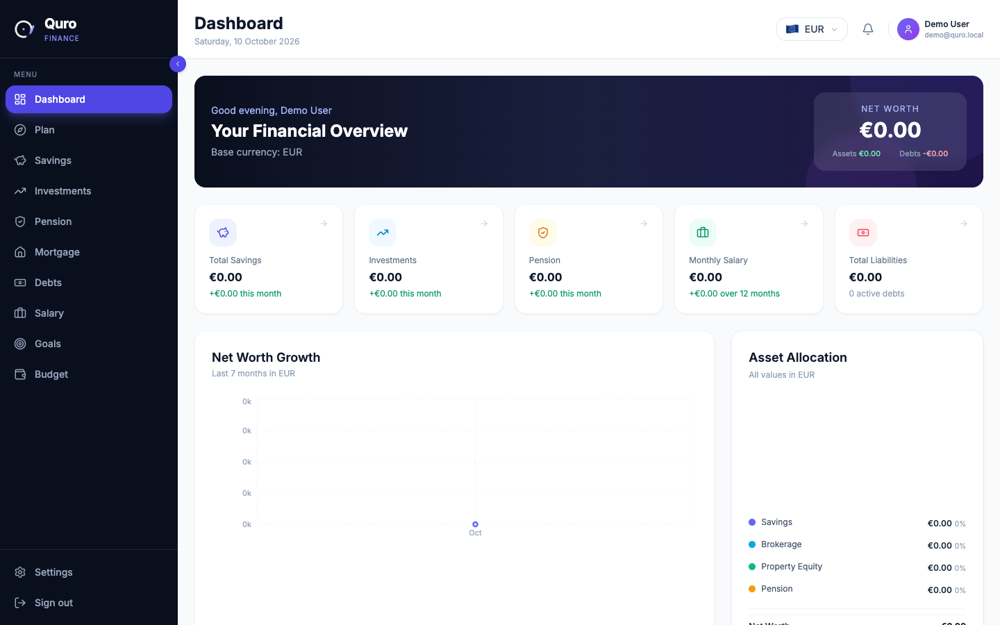
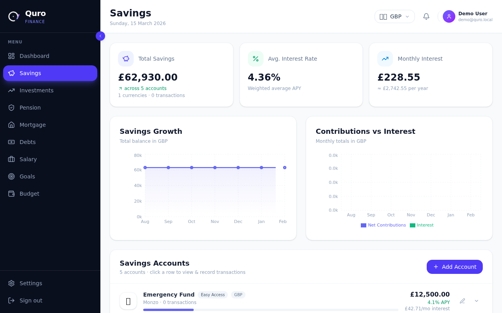
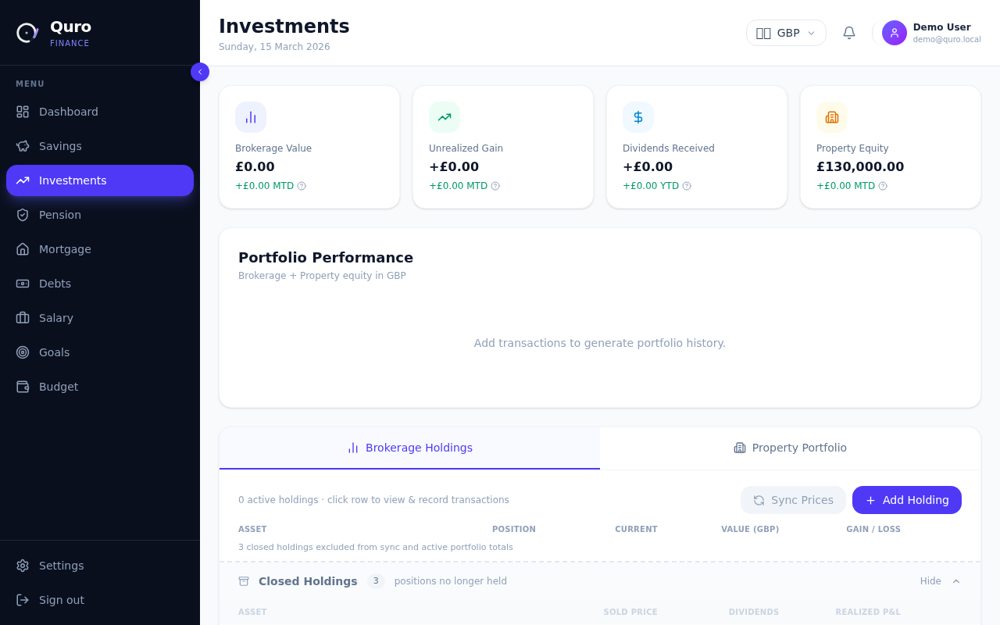
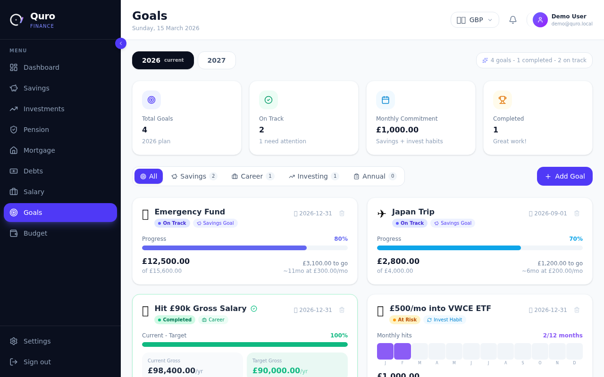
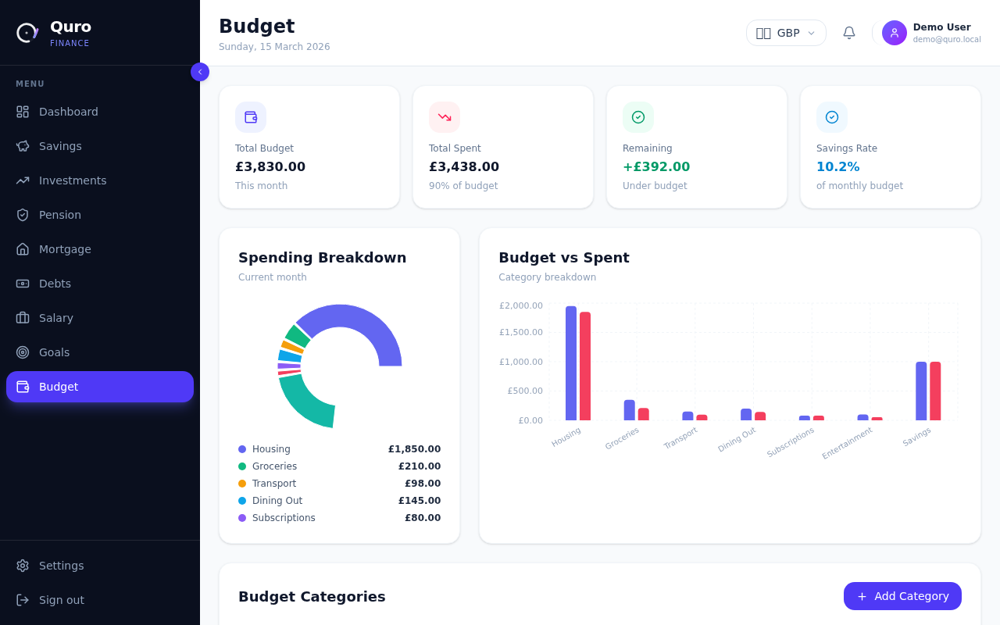
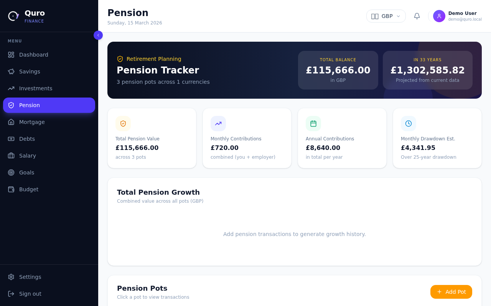
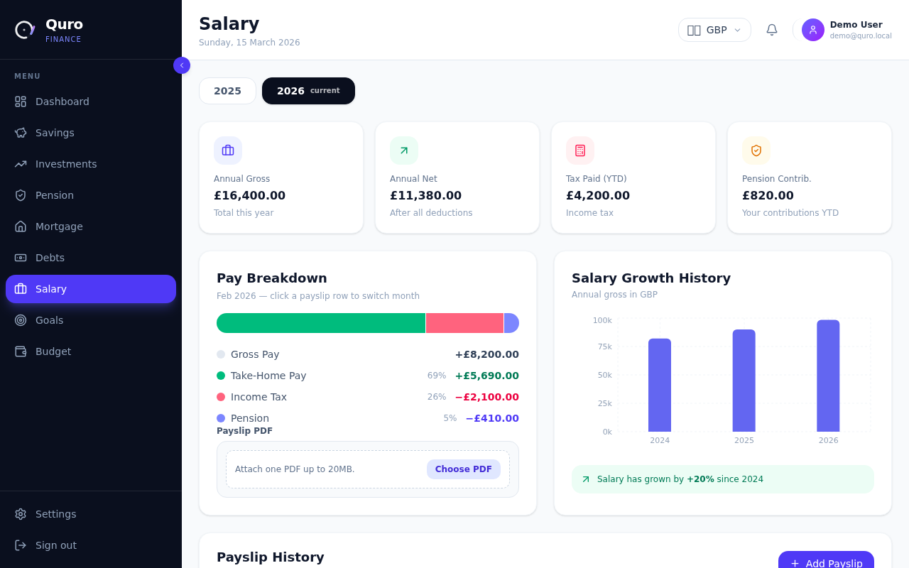
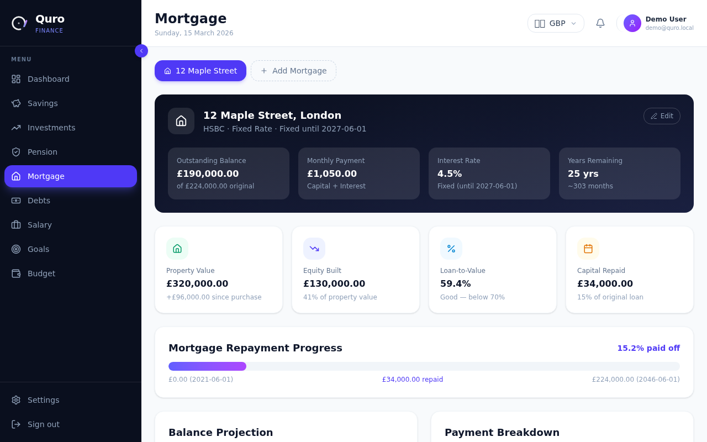
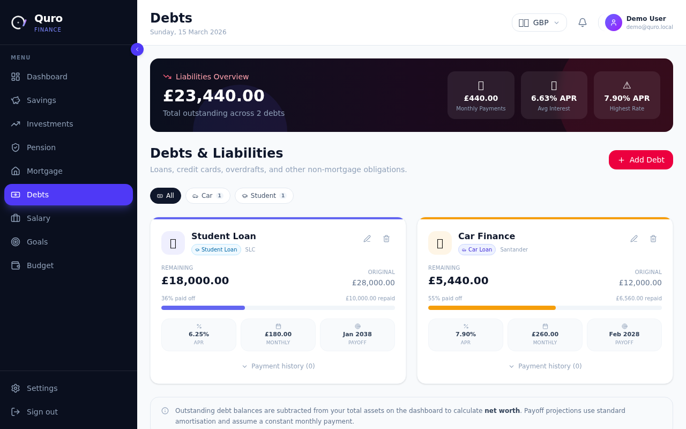

# Quro

[](https://github.com/Pieter-OHearn/quro/releases/latest)
[](https://github.com/Pieter-OHearn/quro/actions/workflows/release.yml)
[](LICENSE)
[](https://github.com/Pieter-OHearn/quro/pkgs/container/quro-frontend)

Quro is a self-hosted personal finance app that brings budgeting, savings, investing, and long-term planning into one dashboard. It tracks your salary, savings accounts, investments, pensions, and financial goals — and lets you attach supporting documents to keep everything in one place. Open source and built to run on your own hardware.

## Local Docker Dev

If you want the app running locally with the least setup, use the Docker dev stack:

```bash
bun run dev:docker
```

Then open `http://localhost:3000`.

For bunq OAuth in this mode, the callback URL is:

```bash
http://localhost:3000/api/bunq/oauth/callback
```

The database and object storage are also published locally for tooling:

- Postgres: `127.0.0.1:5432`
- MinIO API: `127.0.0.1:9000`
- MinIO console: `127.0.0.1:9001`

## Screenshots

<table>
  <tr>
    <td></td>
    <td></td>
  </tr>
  <tr>
    <td align="center"><em>Welcome</em></td>
    <td align="center"><em>Dashboard</em></td>
  </tr>
  <tr>
    <td></td>
    <td></td>
  </tr>
  <tr>
    <td align="center"><em>Savings</em></td>
    <td align="center"><em>Investments</em></td>
  </tr>
  <tr>
    <td></td>
    <td></td>
  </tr>
  <tr>
    <td align="center"><em>Goals</em></td>
    <td align="center"><em>Budget</em></td>
  </tr>
  <tr>
    <td></td>
    <td></td>
  </tr>
  <tr>
    <td align="center"><em>Pension</em></td>
    <td align="center"><em>Salary</em></td>
  </tr>
  <tr>
    <td></td>
    <td></td>
  </tr>
  <tr>
    <td align="center"><em>Mortgage</em></td>
    <td align="center"><em>Debts</em></td>
  </tr>
</table>

## Self-hosting

> [!WARNING]
> Release installs are being reworked. The v0.6.x release assets don't produce a working install on their own, so this README no longer gives a quickstart. Follow progress in [Epic E00: Immediate fixes](https://github.com/Pieter-OHearn/quro/issues/247). To run Quro today, clone the repository and use the [Docker dev stack](#local-docker-dev).

The v0.6.6 release has these known problems. They were verified on 2026-10-04 in a fresh directory with no existing volumes.

| Problem                   | What you see                                                                                                                                                        | Workaround                                                                      |
| :------------------------ | :------------------------------------------------------------------------------------------------------------------------------------------------------------------ | :------------------------------------------------------------------------------ |
| Compose file name         | The file is `docker-compose.release.yml`, so a bare `docker compose` command fails with `no configuration file provided`.                                           | Pass `-f docker-compose.release.yml` or set `COMPOSE_FILE`.                     |
| Config file location      | `.env.template` and `secrets/*.example` aren't release assets. They're inside `auto-update-bundle-vX.Y.Z.tar.gz`.                                                   | Extract the bundle to get them.                                                 |
| Missing storage bootstrap | The release has no `minio-init` service, so the `quro_app` storage user and the document bucket are never created. Document uploads fail with `InvalidAccessKeyId`. | None verified.                                                                  |
| Missing `db-tools`        | The release has no `db-tools` service, so there are no backup and restore commands.                                                                                 | Stop the stack and copy `./data/postgres` and `./data/minio`. This is untested. |
| Corrupted healthcheck     | The `db` healthcheck renders as `pg_isready -U "$" -d "$"`. The container still reports healthy because `pg_isready` falls back to defaults.                        | None needed.                                                                    |
| MinIO image               | `docker compose pull` was denied for the pinned `minio/minio` image. The test host started MinIO only because it had a local copy.                                  | None verified.                                                                  |

You don't need `docker login ghcr.io` for the core images. `quro-frontend` and `quro-backend` pull anonymously. The optional `quro-auto-updater` image doesn't, and the auto-updater is being retired.

The database, migrations, backend and frontend start from the release assets. The missing storage bootstrap and the unpullable MinIO image are why no complete install path exists.

## Contributing

See [docs/development.md](docs/development.md) for the local development setup and [CONTRIBUTING.md](docs/CONTRIBUTING.md) for the release process.

Install the pre-commit hook before your first commit:

```bash
brew install gitleaks
bun run hooks:install
```

## License

[MIT](LICENSE)
