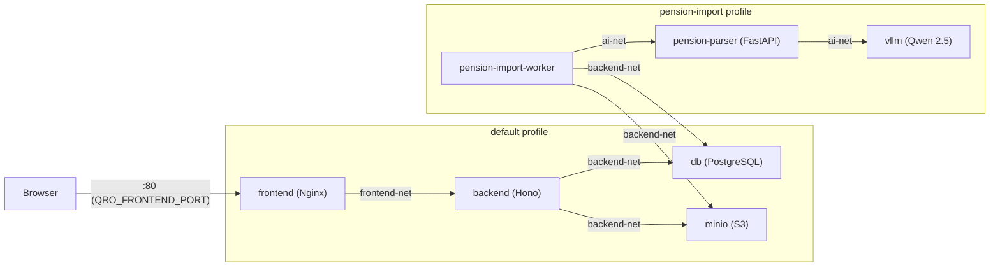
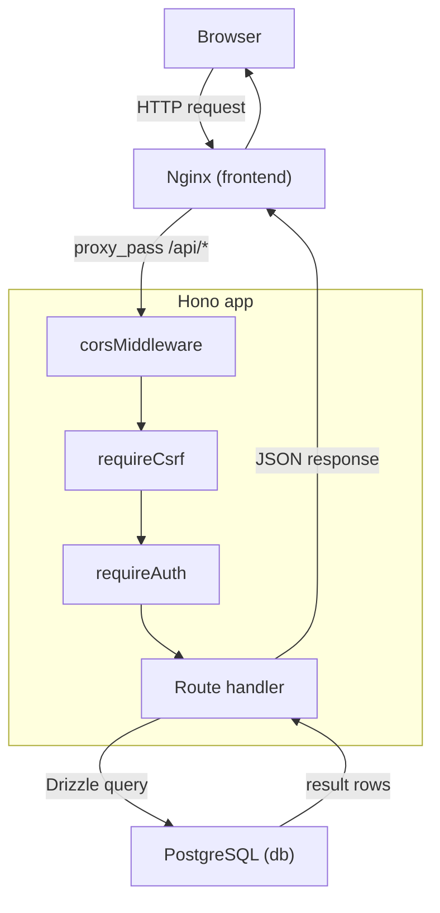
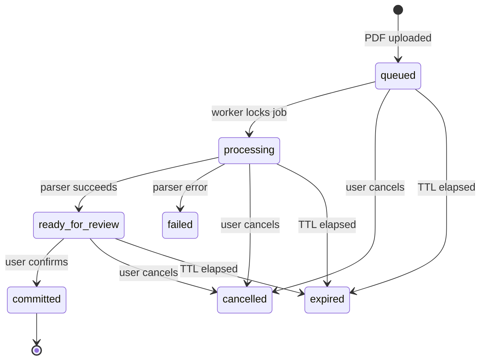

# Architecture

Quro is a self-hosted personal finance app intended for home/LAN use over plain HTTP. This document covers service topology, request flow, the pension import pipeline, and the conventions shared across all features.

---

## 1. Service Topology

### Docker Compose profiles

| Profile                              | Services included                                             |
| ------------------------------------ | ------------------------------------------------------------- |
| default (no profile flag)            | `frontend`, `backend`, `db`, `minio`, `minio-init`, `migrate` |
| `pension-import`                     | adds `pension-import-worker`, `vllm`, `pension-parser`        |
| `maintenance`                        | adds `db-tools`                                               |
| `auto-update` (release compose file) | adds `auto-updater`                                           |

### Host-exposed ports

| Service               | Host port                  | Notes                                    |
| --------------------- | -------------------------- | ---------------------------------------- |
| `frontend`            | `${QRO_FRONTEND_PORT:-80}` | Nginx, the only entry point for browsers |
| `minio`               | none (internal only)       | Console on :9001 is not exposed          |
| `db`, `backend`, etc. | none                       | Internal only                            |

### Network map

Three Docker bridge networks isolate traffic. Services are only placed on networks they need.



**Network membership summary:**

| Service               | frontend-net | backend-net | ai-net |
| --------------------- | ------------ | ----------- | ------ |
| frontend              | yes          | no          | no     |
| backend               | yes          | yes         | no     |
| db                    | no           | yes         | no     |
| minio                 | no           | yes         | no     |
| minio-init            | no           | yes         | no     |
| migrate               | no           | yes         | no     |
| pension-import-worker | no           | yes         | yes    |
| pension-parser        | no           | no          | yes    |
| vllm                  | no           | no          | yes    |
| db-tools              | no           | yes         | no     |

The frontend can reach the backend (via `frontend-net`) but cannot directly reach the database, MinIO, or the AI services. The pension import worker bridges `backend-net` (for DB and MinIO) and `ai-net` (for the parser). The parser and vLLM are isolated on `ai-net` and are unreachable from the browser or the Hono API server directly.

### One-shot services

- `migrate`: runs Drizzle migrations on startup using the admin DB role, then exits.
- `minio-init`: creates the S3 bucket and the `quro_app` MinIO user, then exits.
- `db-tools`: interactive shell for backup/restore; only started with the `maintenance` profile.

---

## 2. Frontend ↔ Backend Communication

### Docker stack (production-like)

Nginx serves the built React SPA as static files. All requests to `/api/*` are reverse-proxied to `http://backend:3000` over the internal `frontend-net`. The browser sees a single origin; no CORS headers are involved. `client_max_body_size` is set to 25 MB to allow PDF uploads.

### Local development (split-origin)

The Vite dev server runs on `:5173` and the Bun API server on `:3000`. The Axios instance in `src/lib/api.ts` uses `VITE_API_URL` as its `baseURL` and sets `withCredentials: true` so the session cookie is sent cross-origin. CORS headers on the backend allow the Vite origin.

### Authentication

Authentication is session-based. On login, the backend writes a random session ID to the `sessions` table and sets an HTTP-only cookie on the response. All subsequent requests carry the cookie. The `requireAuth` middleware reads the cookie, validates the session against the DB, and attaches `{ id, name, email }` to the Hono context. Sessions have a 30-day TTL and are cleaned up by a background interval started in `index.ts` via `startSessionCleanup()`.

### CSRF protection

The backend applies a `requireCsrf` middleware globally to all routes (including public ones). It uses a cookie + request-header token pair. The Axios client injects the CSRF header on every mutating request. Read requests (GET) are not subject to CSRF checks.

---

## 3. Request Lifecycle

A typical authenticated API call follows this path:



Public routes (`/api/auth/*`, `/api/health`, `/api/readiness`, `/api/readiness/pension-import`) bypass `requireAuth` but still pass through the CORS and CSRF middleware.

The global error handler (`src/middleware/errorHandler.ts`) catches any unhandled exception and returns `{ error: message }` JSON with an appropriate status code.

---

## 4. Pension Import Pipeline

This is the most complex feature. It spans multiple services and has a well-defined status lifecycle.

### Import status lifecycle



### Step-by-step walkthrough

**1. Upload**

The user selects a PDF on the Pension page in the frontend and submits it with a `potId`. The frontend `POST`s to `/api/pensions/imports` as `multipart/form-data`.

The backend (`pension-imports.ts`) validates the file (PDF MIME type, size), hashes it with SHA-256 to detect duplicates, uploads the bytes to MinIO under the key `users/{userId}/pensions/{potId}/imports/{uuid}.pdf`, then inserts a row into `pension_statement_imports` with `status = 'queued'`. The PDF storage key is stored in the DB record; the actual bytes never touch the DB.

**2. Worker picks up the job**

The `pension-import-worker` container runs `bun run worker:pension-imports`, which loads `pensionImportWorker.ts`. It runs two concurrent loops:

- **Processing loop**: polls every `IMPORT_WORKER_POLL_INTERVAL_MS` (default 3 s). Each tick calls `runPensionImportWorkerTick()`, which first expires any imports whose `expiresAt` has passed (default 7-day TTL), then calls `lockNextQueuedImport()`. The lock is an optimistic `UPDATE ... WHERE status = 'queued'` that sets `status = 'processing'`; this prevents double-processing if two workers were ever running.
- **Heartbeat loop**: every 5 s, the worker checks the pension-parser's `/health` endpoint and upserts a row in `worker_heartbeats`. The backend reads this table to decide whether the `pensionStatementImport` capability is enabled.

**3. PDF parsing**

Once locked, the worker fetches the PDF bytes from MinIO and calls `parsePensionStatement()` in `pensionParserClient.ts`. This posts the PDF as a multipart form to the `pension-parser` service at `POST /v1/extract`, passing `provider`, `currency`, and `languageHints`.

The `pension-parser` is a FastAPI service that uses pdf2image/OCR to extract text from the PDF. It optionally calls vLLM (running Qwen 2.5 by default) for structured extraction when the regex-only fallback is insufficient. The parser response includes:

- `statementPeriodStart` / `statementPeriodEnd` — ISO date strings
- `modelName` / `modelVersion` — which model was used (null for regex-only)
- `rows[]` — one entry per extracted transaction, each with a `confidence` score (0–1), a `confidenceLabel` (high/medium/low), and an `evidence` array of page/snippet pairs

The parser can be configured via environment variables:

- `PARSER_ALLOW_REGEX_FALLBACK=true` — fall back to regex if the LLM fails
- `PARSER_REGEX_ONLY=true` — skip the LLM entirely

**4. Persisting results**

The worker checks for duplicate statements (same file hash + period against `ACTIVE_IMPORT_STATUSES`). If none, it inserts all rows into `pension_statement_import_rows` (with collision warnings for any row that matches an existing transaction by type, date, and amount within 0.01), and updates the import record to `status = 'ready_for_review'`. On any error, `status` becomes `'failed'` with an error message.

**5. User review**

The frontend polls the import list and shows the import when `status = 'ready_for_review'`. The user sees all extracted rows with their confidence labels and any collision warnings. Rows can be edited (`PATCH /api/pensions/imports/:id/rows/:rowId`), soft-deleted (`DELETE`), or restored (`POST .../restore`). Only fields in `EDITABLE_IMPORT_ROW_FIELDS` (`type`, `amount`, `taxAmount`, `date`, `note`, `isEmployer`) can be changed.

**6. Commit**

When the user confirms, the frontend calls `POST /api/pensions/imports/:id/commit`. The backend re-validates all non-deleted rows, checks for duplicates one final time, then in a single DB transaction:

- Inserts each row as a real `pension_transactions` record.
- For the mandatory `annual_statement` row, attaches the PDF document metadata (storage key, filename, size) inline on the transaction record.
- Updates `pension_pots.balance` by the computed delta for each transaction (contributions add `amount - taxAmount`, fees subtract `amount`, annual statements set the `amount` directly).
- Marks each `pension_statement_import_rows` row with its `committed_transaction_id`.
- Updates the import to `status = 'committed'`.

Exactly one `annual_statement` row must be present; the commit is rejected otherwise.

**7. Capabilities system**

`GET /api/capabilities` (authenticated) reads the `worker_heartbeats` table and returns an `AppCapabilities` object with two fields: `ai` and `pensionStatementImport`. Each is an `AppCapabilityStatus` with `enabled`, `reason`, `message`, and `checkedAt`.

The `pensionStatementImport` capability is disabled when:

- No heartbeat row exists or the worker status is not `idle`/`processing` (`reason: 'worker_unavailable'`)
- The last heartbeat is more than 15 s old (`reason: 'worker_stale'`)
- The parser health check failed (`reason: 'parser_unhealthy'`)

The `ai` capability mirrors `pensionStatementImport` (it is the same underlying check).

The frontend (`useAppCapabilities.ts`) polls this endpoint every 15 s and uses the result to show or hide the PDF upload button. The default state (used before the first response arrives) shows both capabilities as disabled.

---

## 5. The @quro/shared Package

`packages/shared` is a TypeScript-only package with no runtime dependencies. It exports all types that cross the HTTP API boundary — every request body, response payload, and enumeration used by both the frontend and backend.

It is the single source of truth for cross-boundary data shapes. Any new type that appears in both a route handler and a frontend hook must be defined here, not duplicated in each package.

Both `packages/backend` and `packages/frontend` import from it as `@quro/shared` via path aliases in their respective `tsconfig.json` files. Because it is types-only, it produces no compiled output and adds no bundle weight.

Notable exports:

- Primitive enumerations: `CurrencyCode`, `NumberFormatPreference`, `DebtType`, `TickerItemType`
- Domain types: `User`, `SavingsAccount`, `Holding`, `PensionPot`, `Mortgage`, `Debt`, `Payslip`, `Goal`, `BudgetCategory`, etc.
- Import pipeline types: `PensionStatementImport`, `PensionStatementImportRow`, `PensionImportStatus`, `PensionImportConfidenceLabel`
- Capabilities types: `AppCapabilities`, `AppCapabilityStatus`, `AppCapabilityReason`
- Currency helpers: `CURRENCY_META`, `isCurrencyCode`, `CURRENCY_CODES`

---

## 6. Feature Module Pattern

All features follow a consistent structure on both sides of the stack.

### Backend

Each feature is a `new Hono()` instance in `src/routes/<feature>.ts`, exported as default. It is mounted in `src/index.ts` with two lines:

```ts
app.use('/api/<feature>/*', requireAuth);   // guard
app.route('/api/<feature>', <feature>);     // mount
```

There is no shared base router for protected routes; auth is applied per-prefix. The pension import feature is an exception — its routes live in `src/routes/pension-imports.ts` but are mounted at `/api/pensions/imports` and under the `requireAuth` guard for `/api/pensions/*`.

### Frontend

Each feature lives in `src/features/<feature>/` and contains:

- `index.tsx` — the page component, rendered by the router
- `components/` — feature-specific UI components
- `hooks/index.ts` — TanStack Query hooks: `useQuery` hooks for reads and `useMutation` hooks for writes

Mutations follow a fixed invalidation pattern: on success, they invalidate both the feature's own query key and the `['dashboard']` query key. This keeps the dashboard summary in sync without a page reload.

### Query key conventions

Feature query keys are simple arrays like `['savings']`, `['pension']`, `['investments']`. The dashboard key is `['dashboard']`. Capabilities is `['app', 'capabilities']`.

---

## 7. Database Notes

### Currency and monetary precision

All monetary columns use `numeric(19, 2)` (Drizzle: `numeric('col', { precision: 19, scale: 2 })`). Interest rate columns use `numeric(7, 4)`. This avoids floating-point rounding errors in financial calculations. Confidence scores in the import pipeline use `numeric(5, 4)`. Drizzle returns `numeric` columns as strings; route handlers convert them with a local `toNumber()` function before serialising to JSON.

### Sessions

Sessions are stored in the `sessions` table with an `expires_at` timestamp (30-day TTL from login). The backend calls `startSessionCleanup()` on startup, which runs a background interval to delete expired rows. There is no Redis or external session store.

### Two database roles

| Role                                 | Purpose                                                                       |
| ------------------------------------ | ----------------------------------------------------------------------------- |
| `quro_admin` (default: `quro_admin`) | DDL and migrations only; used by the `migrate` one-shot container             |
| `quro_app` (default: `quro_app`)     | Runtime queries from `backend` and `pension-import-worker`; no DDL privileges |

Credentials are supplied via Docker secrets (files in `./secrets/`) and never appear in environment variables or images.

### Schema highlights

- `worker_heartbeats` — keyed by `worker_name` (text PK); upserted by the pension import worker every 5 s. Read by the capabilities system to determine if the worker is alive and the parser is healthy.
- `pension_statement_imports` + `pension_statement_import_rows` — the two tables that back the import pipeline. Import rows reference the parent import via `import_id` with `ON DELETE CASCADE`. Committed rows carry a `committed_transaction_id` FK back to `pension_transactions`.
- Inline PDF document columns (`document_storage_key`, `document_file_name`, `document_size_bytes`, `document_uploaded_at`) are reused on both `pension_transactions` and `payslips` via a shared column factory. A check constraint enforces that all four are either all null or all non-null.
- `holding_price_history` — end-of-day price history for investment holdings, with a unique index on `(holding_id, eod_date)`.
