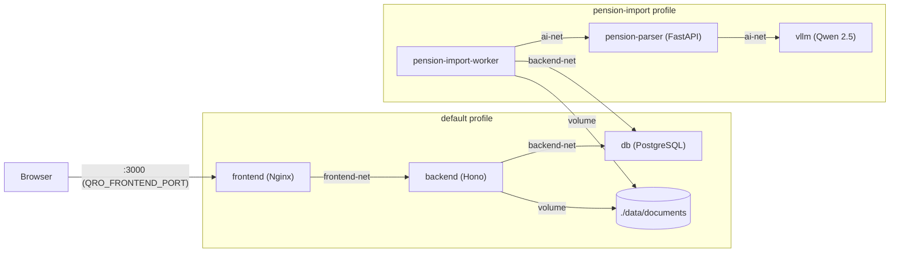
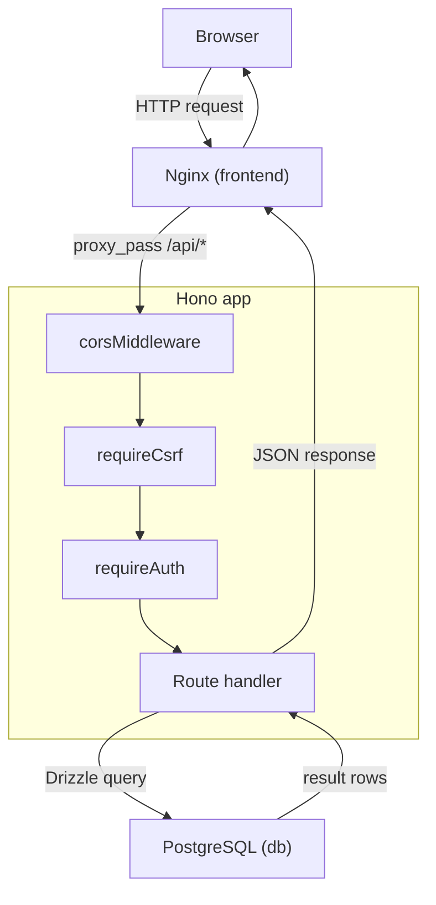
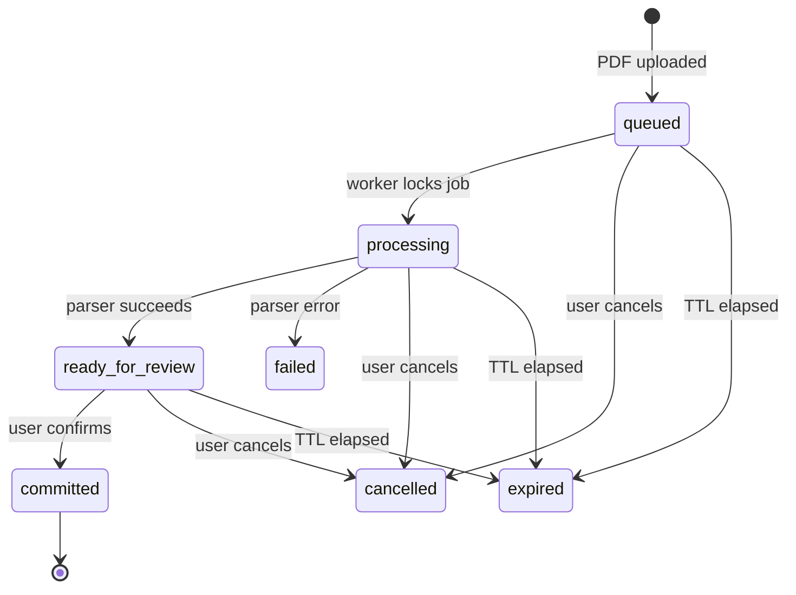

# Architecture

Quro is a self-hosted personal finance app intended for home/LAN use over plain HTTP. This document covers service topology, request flow, bunq integration, the pension import pipeline, and the conventions shared across all features.

---

## 1. Service Topology

### Docker Compose profiles

| Profile                   | Services included                                      |
| ------------------------- | ------------------------------------------------------ |
| default (no profile flag) | `frontend`, `backend`, `db`, `migrate`                 |
| `pension-import`          | adds `pension-import-worker`, `vllm`, `pension-parser` |
| `maintenance`             | adds `db-tools`                                        |

### Host-exposed ports

| Service               | Host port                    | Notes                                    |
| --------------------- | ---------------------------- | ---------------------------------------- |
| `frontend`            | `${QRO_FRONTEND_PORT:-3000}` | Nginx, the only entry point for browsers |
| `db`, `backend`, etc. | none                         | Internal only                            |

### Network map

Three Docker bridge networks isolate traffic. Services are only placed on networks they need.


```mermaid
graph LR
  Browser -->|":3000 (QRO_FRONTEND_PORT)"| frontend

  subgraph "default profile"
    frontend["frontend (Nginx)"]
    backend["backend (Hono)"]
    db["db (PostgreSQL)"]
    documents[("./data/documents")]
    frontend -->|frontend-net| backend
    backend -->|backend-net| db
    backend -->|volume| documents
  end

  subgraph "pension-import profile"
    worker["pension-import-worker"]
    parser["pension-parser (FastAPI)"]
    vllm["vllm (Qwen 2.5)"]
    worker -->|backend-net| db
    worker -->|volume| documents
    worker -->|ai-net| parser
    parser -->|ai-net| vllm
  end
```

**Network membership summary:**

| Service               | frontend-net | backend-net | ai-net |
| --------------------- | ------------ | ----------- | ------ |
| frontend              | yes          | no          | no     |
| backend               | yes          | yes         | no     |
| db                    | no           | yes         | no     |
| migrate               | no           | yes         | no     |
| pension-import-worker | no           | yes         | yes    |
| pension-parser        | no           | no          | yes    |
| vllm                  | no           | no          | yes    |
| db-tools              | no           | yes         | no     |

The frontend can reach the backend (via `frontend-net`) but cannot directly reach the database, the documents directory or the AI services. The pension import worker bridges `backend-net` (for the database) and `ai-net` (for the parser), and mounts the same documents directory as the backend. The parser and vLLM are isolated on `ai-net` and are unreachable from the browser or the Hono API server directly.

Uploaded documents are stored on the filesystem (`./data/documents`, mounted at `/var/lib/quro/documents`) by default. An S3-compatible store the operator runs is the alternative; the backend then reaches it over the network instead of the volume. See [document storage](document-storage.md).

### One-shot services

- `migrate`: runs Drizzle migrations on startup using the admin DB role, then exits.
- `db-tools`: interactive shell for backup/restore; only started with the `maintenance` profile.

---

## 2. Frontend ↔ Backend Communication

### Docker stack (production-like)

Nginx serves the built React SPA as static files. All requests to `/api/*` are reverse-proxied to `http://backend:3000` over the internal `frontend-net`. The browser sees a single origin; no CORS headers are involved. `client_max_body_size` is set to 25 MB to allow PDF uploads.

### Local development (split-origin)

The Vite dev server runs on `:5173` and the Bun API server on `:3000`. The Axios instance in `src/lib/api.ts` uses `VITE_API_URL` as its `baseURL` and sets `withCredentials: true` so the session cookie is sent cross-origin. CORS headers on the backend allow the Vite origin.

### Authentication

Authentication is session-based (`src/lib/sessions.ts`). On sign-in, the backend generates a random token, stores only its SHA-256 digest in the `sessions` table and sets the token in an HTTP-only cookie. All subsequent requests carry the cookie. The `requireAuth` middleware hashes the cookie, validates the session against the DB, and attaches `{ id, email }`, the session id and the accepted `partnerId` to the Hono context in one session query. Sessions have a 30-day TTL and are cleaned up by a background interval started in `index.ts` via `startSessionCleanup()`.

Sign-up follows `QRO_REGISTRATION_MODE` (`src/lib/registration.ts`): the first account always needs an operator-issued setup code, and later sign-ups need an invite code unless the operator opts in to open registration. Operators issue registration and password reset codes with the `quro` command in the backend image (`src/cli/`). See [the security model](security.md) for the deployment modes, registration policy and recovery.

### CSRF protection

The backend applies a `requireCsrf` middleware globally to all routes. It uses a cookie + request-header token pair. The Axios client injects the CSRF header on every mutating request. Read requests (GET) are not subject to CSRF checks. Public auth endpoints run before a token exists, so their `POST` requests must be JSON instead; only sign-out may have no body.

---

## 3. Request Lifecycle

A typical authenticated API call follows this path:


```mermaid
graph TD
  Browser -->|HTTP request| Nginx["Nginx (frontend)"]
  Nginx -->|"proxy_pass /api/*"| CORS

  subgraph "Hono app"
    CORS["corsMiddleware"] --> CSRF["requireCsrf"]
    CSRF --> Auth["requireAuth"]
    Auth --> Handler["Route handler"]
  end

  Handler -->|Drizzle query| PG["PostgreSQL (db)"]
  PG -->|result rows| Handler
  Handler -->|JSON response| Nginx
  Nginx --> Browser
```

All `/api/*` routes require authentication by default. Exact public paths in `src/lib/publicPaths.ts` (signin, signup, signout, session discovery, the registration policy, operator-code password reset, health, readiness, and the signed Bunq OAuth callback) are shared by auth and CSRF middleware; new routes under these prefixes remain protected.

The global error handler (`src/middleware/errorHandler.ts`) catches any unhandled exception and returns `{ error: message }` JSON with an appropriate status code.

### Tracing

The backend can export OpenTelemetry traces over OTLP/HTTP (`src/lib/tracing.ts`). It's off unless `OTEL_EXPORTER_OTLP_ENDPOINT` (or `OTEL_EXPORTER_OTLP_TRACES_ENDPOINT`) is set; `OTEL_SDK_DISABLED=true` turns it off again.

- `httpTracing`, the first middleware, opens a server span per request. It continues the caller's W3C `traceparent` (Nginx passes it through), and records the method, path, matched route, and status. A 5xx or a handler error marks the span as failed. The query string isn't recorded.
- Every Postgres query Drizzle runs, including inside transactions, gets a child client span with the parameterized query text. Parameter values aren't recorded.
- The service name is `quro-backend` unless `OTEL_SERVICE_NAME` sets another. Every sampled parent is kept, so sampling belongs to the collector.

---

## 4. bunq Integration

The bunq integration is optional and runs inside the main backend process. There is no separate Docker profile or worker container for it.

### OAuth and connection routes

The Settings page starts OAuth by sending the browser to `/api/bunq/oauth/start`. The backend records a single-use OAuth attempt for the user and destination in `bunq_oauth_attempts` (only a hash of the random state is stored), sets the state in an HTTP-only `bunq_oauth_state` cookie for 10 minutes, and redirects to bunq's OAuth authorisation URL.

bunq redirects back to `/api/bunq/oauth/callback`. The backend requires the state cookie to match the returned state, atomically consumes the recorded attempt, exchanges the authorisation code with `BUNQ_CLIENT_ID`, `BUNQ_CLIENT_SECRET`, and `BUNQ_REDIRECT_URI`, then upserts a row in `bunq_connections` with the returned access token. The frontend reads connection status through `GET /api/bunq/connection` and disconnects with `DELETE /api/bunq/connection`.

Manual sync endpoints are mounted under the same protected route group:

- `POST /api/bunq/sync` — syncs savings and budget data together and advances the shared cursor when both succeed.
- `POST /api/bunq/sync/savings` — syncs bunq `SAVINGS` monetary accounts into Quro savings accounts and transactions.
- `POST /api/bunq/sync/budget` — syncs bunq `BANK` monetary account payments into budget transactions.

### Sync behaviour

The sync services reuse the stored bunq access token to create or refresh a bunq API installation/session. Session material (`private_key`, `installation_token`, `server_public_key`, `session_token`, `session_id`, `session_expires_at`) is cached in `bunq_connections` so normal syncs do not repeat the full bootstrap on every request.

Savings sync creates or updates local savings accounts for bunq savings accounts, imports payments into `savings_transactions`, and detaches local accounts whose bunq account ID no longer appears in the latest bunq account list. Budget sync imports bank payments into `budget_transactions`, skips self-transfers, maps merchant category codes through `category_mappings`, and stores bunq metadata for idempotency and review.

### Background sync scheduler

For timeout limits and recovery steps, see [Troubleshoot provider timeouts](provider-timeouts.md).

`src/index.ts` starts `startBunqSyncScheduler()` when the backend starts. The scheduler runs in-process once per hour, selects every user with a row in `bunq_connections`, and calls `syncBunqSavings(userId)` followed by `syncBunqBudget(userId)`. Failures are logged and written back to the connection's `sync_status` / `sync_error` fields; they do not stop the scheduler from trying later users or future hourly cycles.

---

## 5. Pension Import Pipeline

This is the most complex feature. It spans multiple services and has a well-defined status lifecycle.

### Import status lifecycle


```mermaid
stateDiagram-v2
  [*] --> queued : PDF uploaded

  queued --> processing : worker locks job
  queued --> cancelled : user cancels
  queued --> expired : TTL elapsed

  processing --> ready_for_review : parser succeeds
  processing --> failed : parser error
  processing --> cancelled : user cancels
  processing --> expired : TTL elapsed

  ready_for_review --> committed : user confirms
  ready_for_review --> cancelled : user cancels
  ready_for_review --> expired : TTL elapsed

  committed --> [*]
```

### Step-by-step walkthrough

**1. Upload**

The user selects a PDF on the Pension page in the frontend and submits it with a `potId`. The frontend `POST`s to `/api/pensions/imports` as `multipart/form-data`.

The backend (`pension-imports.ts`) validates the file (PDF MIME type, size), hashes it with SHA-256 to detect duplicates, stores the bytes in the document store under the key `users/{userId}/pensions/{potId}/imports/{uuid}.pdf`, then inserts a row into `pension_statement_imports` with `status = 'queued'`. The PDF storage key is stored in the DB record; the actual bytes never touch the DB.

**2. Worker picks up the job**

The `pension-import-worker` container runs the backend's `worker:pension-imports` script (see `docker-compose.yml`), which loads `pensionImportWorker.ts`. It runs two concurrent loops:

- **Processing loop**: polls every `IMPORT_WORKER_POLL_INTERVAL_MS` (default 3 s). Each tick calls `runPensionImportWorkerTick()`, which first expires any imports whose `expiresAt` has passed (default 7-day TTL), then calls `lockNextQueuedImport()`. The lock is an optimistic `UPDATE ... WHERE status = 'queued'` that sets `status = 'processing'`; this prevents double-processing if two workers were ever running.
- **Heartbeat loop**: every 5 s, the worker checks the pension-parser's `/health` endpoint and upserts a row in `worker_heartbeats`. The backend reads this table to decide whether the `pensionStatementImport` capability is enabled.

**3. PDF parsing**

Once locked, the worker reads the PDF bytes from the document store and calls `parsePensionStatement()` in `pensionParserClient.ts`. This posts the PDF as a multipart form to the `pension-parser` service at `POST /v1/extract`, passing `provider`, `currency`, and `languageHints`.

The `pension-parser` is a FastAPI service that uses pdf2image/OCR to extract text from the PDF. It optionally calls vLLM (running Qwen 2.5 by default) for structured extraction when the regex-only fallback is insufficient. The parser response includes:

- `statementPeriodStart` / `statementPeriodEnd` — ISO date strings
- `modelName` / `modelVersion` — which model was used (null for regex-only)
- `rows[]` — one entry per extracted transaction, each with a `confidence` score (0–1), a `confidenceLabel` (high/medium/low), and an `evidence` array of page/snippet pairs

The parser can be configured via environment variables:

- `PARSER_ALLOW_REGEX_FALLBACK=true` — fall back to regex if the LLM fails
- `PARSER_REGEX_ONLY=true` — skip the LLM entirely

**4. Persisting results**

The worker checks for duplicate statements (same file hash + period against `ACTIVE_IMPORT_STATUSES`). If none, it inserts all rows into `pension_statement_import_rows` (with collision warnings for any row that matches an existing transaction by type, date, and amount within 0.01), and updates the import record to `status = 'ready_for_review'`. On any error, `status` becomes `'failed'` with an error message.

**5. User review**

The frontend polls the import list and shows the import when `status = 'ready_for_review'`. The user sees all extracted rows with their confidence labels and any collision warnings. Rows can be edited (`PATCH /api/pensions/imports/:id/rows/:rowId`), soft-deleted (`DELETE`), or restored (`POST .../restore`). Only fields in `EDITABLE_IMPORT_ROW_FIELDS` (`type`, `amount`, `taxAmount`, `date`, `note`, `isEmployer`) can be changed.

**6. Commit**

When the user confirms, the frontend calls `POST /api/pensions/imports/:id/commit`. The backend re-validates all non-deleted rows, checks for duplicates one final time, then in a single DB transaction:

- Inserts each row as a real `pension_transactions` record.
- For the mandatory `annual_statement` row, attaches the PDF document metadata (storage key, filename, size) inline on the transaction record.
- Updates `pension_pots.balance` by the computed delta for each transaction (contributions add `amount - taxAmount`, fees subtract `amount`, annual statements set the `amount` directly).
- Marks each `pension_statement_import_rows` row with its `committed_transaction_id`.
- Updates the import to `status = 'committed'`.

Exactly one `annual_statement` row must be present; the commit is rejected otherwise.

**7. Capabilities system**

`GET /api/capabilities` (authenticated) returns an `AppCapabilities` object with four fields: `ai`, `pensionStatementImport`, `bunq` and `documents`. Each is an `AppCapabilityStatus` with `enabled`, `reason`, `message`, and `checkedAt`. Document storage is part of the core, so `documents` is always enabled; whether the configured store is usable is a readiness check (`GET /api/readiness`).

Whether a feature is switched on comes from configuration alone and is decided by the capability registry (`lib/capabilityRegistry.ts`), the single source of truth for optional features:

| Capability      | Enabled when                                                                                |
| --------------- | ------------------------------------------------------------------------------------------- |
| `bunq`          | the complete bunq OAuth settings are present                                                |
| `s3Storage`     | `QRO_DOCUMENT_STORAGE=s3` selects an S3-compatible store instead of the documents directory |
| `pensionImport` | `PENSION_PARSER_URL` is set (reported as `pensionStatementImport`)                          |

`app.ts` mounts the routes of a capability (`/api/bunq`, `/api/pensions/imports`) only when it is enabled, and `schedulers.ts` starts the bunq sync only then, so an instance without bunq has no bunq endpoints and runs no bunq job. A capability that is not configured reports `reason: 'not_configured'`. For `pensionStatementImport`, the worker's runtime state is checked on top of that.

The `pensionStatementImport` capability is disabled when:

- It is not configured (`reason: 'not_configured'`)
- No heartbeat row exists or the worker status is not `idle`/`processing` (`reason: 'worker_unavailable'`)
- The last heartbeat is more than 15 s old (`reason: 'worker_stale'`)
- The parser health check failed (`reason: 'parser_unhealthy'`)

The `ai` capability mirrors `pensionStatementImport` (it is the same underlying check).

The frontend (`useAppCapabilities.ts`) polls this endpoint every 15 s and uses the result to show or hide the PDF upload button. The default state (used before the first response arrives) shows both capabilities as disabled.

---

## 6. The @quro/shared Package

`packages/shared` is a TypeScript source package with no runtime dependencies. It holds every type that crosses the HTTP API boundary (request bodies, response payloads and enumerations) and the pure helpers that both sides must compute identically: number and currency formatting, cent-based money rounding, date-only conversion, loan maths and shared validation rules.

It is the single source of truth for cross-boundary data shapes and those rules. Any new type or rule that appears in both a route handler and the frontend must be defined here, not duplicated in each package.

Both `packages/backend` and `packages/frontend` depend on it as a workspace package (`"@quro/shared": "workspace:*"`) and resolve it to `packages/shared/src` through the `paths` entry in their `tsconfig.json`. It is never compiled or published on its own: Bun runs the source in the backend, and Vite bundles the helpers the frontend imports.

Notable exports:

- Primitive enumerations: `CurrencyCode`, `NumberFormatPreference`, `DebtType`, `TickerItemType`
- Domain types: `User`, `SavingsAccount`, `Holding`, `PensionPot`, `Mortgage`, `Debt`, `Payslip`, `Goal`, `BudgetCategory`, `BunqConnection`, etc.
- Import pipeline types: `PensionStatementImport`, `PensionStatementImportRow`, `PensionImportStatus`, `PensionImportConfidenceLabel`
- Capabilities types: `AppCapabilities`, `AppCapabilityStatus`, `AppCapabilityReason`
- Currency helpers: `CURRENCY_META`, `isCurrencyCode`, `CURRENCY_CODES`
- Formatting: `formatNumber`, `formatCurrency`, `formatPercent` (`src/utils/index.ts`)
- Money: `toCents`, `fromCents`, `roundMoney` (`src/utils/money.ts`); see [currency and monetary precision](#currency-and-monetary-precision)
- Dates: `toIsoDate`, `toDateOnly` (UTC) and `todayIsoDate` (local calendar day) (`src/utils/date.ts`)
- Loan maths and validation: `monthlyInterest`, `monthsToPayoff` (`src/utils/finance.ts`), and the `validate*` rules in `src/utils/validation.ts`

---

## 7. Feature Module Pattern

All features follow a consistent structure on both sides of the stack.

### Backend

Each feature is a `new Hono()` instance in `src/routes/<feature>.ts`, exported as default. It is mounted in `src/index.ts` with one line:

```ts
app.route('/api/<feature>', feature);
```

The global `app.use('/api/*', requireAuth)` guard also protects newly mounted features. Pension imports live in `src/routes/pension-imports.ts` and mount at `/api/pensions/imports`.

`src/lib/access.ts` provides owned and joint parent/child queries with a consistent id and access scope. `registerTransactionReadRoutes` shares transaction list/get handlers while preserving each ledger's query validation and inaccessible-parent response. `registerArchivableResource` handles archive, restore, and explicit cascade deletion, with transaction hooks for property/mortgage link rules. Dated ledger mutations call `withLedgerWrite` inside the database transaction to invalidate snapshots for all affected owners, including both partners on joint assets and both parents when a transaction moves.

Dashboard history and activity live in `src/lib/netWorthHistory.ts` and `src/lib/activity.ts`. Investments mounts the holding and property routers from `src/routes/holdings.ts` and `src/routes/properties.ts`.

Ledger lists are paged with a keyset cursor (`src/lib/listPage.ts`): the transaction lists of savings, holdings, properties, mortgages and pensions, debt payments, payslips, pension statement documents, pension import rows, budget transactions and holding price history. Each answers `{ data, nextCursor }` with at most `limit` rows; `LIST_PAGE_DEFAULT_LIMIT` and the hard cap `LIST_PAGE_MAX_LIMIT` come from `@quro/shared`, and a larger `limit` is reduced to the cap. Rows follow an explicit order: date, then id, ascending, so rows entered on one day keep their entry order. Budget transactions are newest first, price history is ordered by day and then holding, and import rows by statement position and then id. A client passes `nextCursor` back as `cursor` until it is `null`; a malformed `limit` or `cursor` answers 400. Price history requires `from`. Other collections (accounts, holdings, pots, debts, goals, budget categories) are small, unpaged and ordered by id. Totals such as salary history, dashboard and runway are computed on the server over the whole ledger and are not paged.

### Frontend

Each feature lives in `src/features/<feature>/` and contains:

- `index.tsx` — the page component, rendered by the router
- `components/` — feature-specific UI components
- `hooks/index.ts` — TanStack Query hooks: `useQuery` hooks for reads and `useMutation` hooks for writes

Hooks that read a paged ledger call `apiGetAllPages` from `src/lib/api.ts`. It requests the hard cap per page and follows `nextCursor` to the last page, so totals the browser computes from a ledger still cover every row; budget transactions are windowed by month and price history by its date range. The pages are separate reads, not one snapshot: a row edited to a later position between two pages is kept once, in its newer form, and a row written behind the cursor appears on the next refetch (a ledger mutation made in the app triggers one through its domain).

Mutations use `useDomainMutation`, which invalidates the query keys declared for their domain in `src/lib/queryInvalidation.ts`. Each domain lists only the server readers it affects; for example, goals refresh only goals, while savings also refresh the dashboard and plan.

### Query key conventions

Query keys are defined centrally in `src/lib/queryKeys.ts` as hierarchical arrays, for example `queryKeys.dashboard.summary` is `['dashboard', 'summary']`. Use those constants instead of inline arrays.

---

## 8. Database Notes

### Currency and monetary precision

Every fractional value is stored as a PostgreSQL `numeric`; the schema has no floating-point columns. The precision depends on what the column holds:

| Values                                                | Type             |
| ----------------------------------------------------- | ---------------- |
| Money amounts and balances                            | `numeric(19, 2)` |
| Interest rates                                        | `numeric(7, 4)`  |
| Ratios (import confidence, `emergency_lifestyle_pct`) | `numeric(5, 4)`  |
| Share quantities (`holding_transactions.shares`)      | `numeric(19, 6)` |
| FX rates (`currency_rates`, `currency_rate_history`)  | `numeric(12, 6)` |
| Mortgage fixed-rate term in years (`fixed_years`)     | `numeric(4, 1)`  |

Columns are declared with `numericAsNumber`, a custom type defined in `src/db/schema.ts`. It turns the driver's strings into numbers through `parseDriverNumeric` (`src/db/driverNumeric.ts`), which throws on a non-finite value, and leaves `null` as `null`, so public JSON stays numeric and null-preserving.

Arithmetic happens on JavaScript numbers. Where a result must be whole cents, use `toCents`, `fromCents` and `roundMoney` from `@quro/shared` (see [the shared package](#6-the-quroshared-package)) rather than ad hoc rounding. Rates are not rounded like money. Dashboard and runway totals are aggregated in EUR on the backend and converted once for display; amounts keep their native currency in storage, and a missing or invalid FX rate fails the calculation instead of assuming 1:1.

### Document storage

Uploaded PDFs go through `getDocumentStore()` (`lib/documentStorage.ts`), which returns the driver that `QRO_DOCUMENT_STORAGE` selects: `filesystem` (`lib/filesystemDocumentStore.ts`, the default, one file per object under `QRO_DOCUMENTS_DIR`) or `s3` (`lib/s3.ts`). Rows keep the object key, such as `users/<id>/salary/payslips/<id>/<uuid>.pdf`, which is the same in both drivers; the filesystem driver refuses a key that is not a safe relative path and never creates the documents directory itself. Readiness checks only the configured driver. Tests that inspect stored objects replace the store with `createMemoryDocumentStore()` (`packages/backend/src/test/memoryDocumentStore.ts`); other integration tests use the filesystem driver in a temporary directory. Operator documentation, including `quro documents migrate-from-s3`, is in [document storage](document-storage.md).

### Sessions

Sessions are stored in the `sessions` table, keyed by the SHA-256 digest of the cookie token, with an `expires_at` timestamp (30-day TTL from login), the browser's user agent and a `last_used_at` time. Users list and revoke them in Settings; operators revoke them with `quro user revoke-sessions`. The backend calls `startSessionCleanup()` on startup, which runs a background interval to delete expired rows and old operator codes (`auth_codes`). There is no Redis or external session store.

### Configuration

Every setting the backend reads is declared once, in `packages/backend/src/config/settings.ts`: its name, type, default, whether it is secret, and when it is required. `loadConfig` in `config/load.ts` parses the environment and the secret files it points at a single time, collects every problem instead of stopping at the first, and returns a frozen, typed `Config`. Nothing outside `src/config` reads `process.env` (a lint rule enforces it); code calls `getConfig()`.

- **Fail fast, in full.** A process validates the sections it needs when it starts (`bootConfig('server')` for the API, `'worker'`, `'migrate'`, `'backup'` and `'maintenance'` for the database commands) and exits with code 2 and one list of problems. The list names settings and never their values. A migration job does not need bunq, so its profile does not check it; a section that is invalid throws only when something reads it.
- **Secrets are files.** Database and S3 secrets are read from the files named by `*_FILE` settings (defaults under `/run/secrets/`); a trailing newline is ignored and an empty file is an error. Values are wrapped in `Secret`, which prints as `[redacted]` and needs `.reveal()` to read, so logging the configuration cannot leak a credential.
- **Optional features are all or nothing.** A feature such as S3 storage or bunq stays off until one of its settings is present, and then needs all of them; a half-configured feature stops startup instead of mounting half-working routes. S3 settings alone never select the S3 store: without `QRO_DOCUMENT_STORAGE` they stop every command (profiles all include the `documentStorage` section, which reads no secret), so documents in an existing store are never hidden behind an empty directory.
- **Retired settings are not read.** Names from earlier releases are reported with the setting that replaces them (`config.notices`) and never used as a fallback.
- **The schema is the manifest.** `settingsManifest()` in `config/manifest.ts` lists every setting with its type, default, secrecy and requirement, generated from the same table; the installer and the configuration reference use it, and a test keeps the Compose files, the example files and the docs in step with it.

To add a setting, add it to `SETTINGS`, read it in the section builder that owns it, and mention it in an example file or a doc. Tests that change settings use `applyTestSettings` (`src/test/config.ts`), which re-parses the configuration.

### Two database roles

| Role                                 | Purpose                                                                       |
| ------------------------------------ | ----------------------------------------------------------------------------- |
| `quro_admin` (default: `quro_admin`) | DDL and migrations only; used by the `migrate` one-shot container             |
| `quro_app` (default: `quro_app`)     | Runtime queries from `backend` and `pension-import-worker`; no DDL privileges |

Credentials are supplied as Docker secrets (files in `./secrets/`), not as Compose environment entries, and are not baked into images. The backend reads the password files itself when it starts (`POSTGRES_APP_PASSWORD_FILE`, `POSTGRES_ADMIN_PASSWORD_FILE`, see [Configuration](#configuration)) and builds the connection strings from `POSTGRES_HOST` and the other `POSTGRES_*` settings; the shell wrappers in `docker/backend/` only run the commands in order.

### Schema highlights

- `worker_heartbeats` — keyed by `worker_name` (text PK); upserted by the pension import worker every 5 s. Read by the capabilities system to determine if the worker is alive and the parser is healthy.
- `pension_statement_imports` + `pension_statement_import_rows` — the two tables that back the import pipeline. Import rows reference the parent import via `import_id` with `ON DELETE CASCADE`. Committed rows carry a `committed_transaction_id` FK back to `pension_transactions`.
- Inline PDF document columns (`document_storage_key`, `document_file_name`, `document_size_bytes`, `document_uploaded_at`) are reused on both `pension_transactions` and `payslips` via a shared column factory. A check constraint enforces that all four are either all null or all non-null.
- `holding_price_history` — end-of-day price history for investment holdings, with a unique index on `(holding_id, eod_date)`.
- `bunq_connections` — one row per connected user, enforced by a unique index on `user_id`. It stores the OAuth access token, cached API session fields, bunq user ID, last successful sync cursor, and sync status/error.
- `savings_accounts.bunq_account_id`, `savings_transactions.bunq_transaction_id`, and `budget_transactions.bunq_transaction_id` — bunq identifiers used to make repeated syncs idempotent. Transaction IDs are unique per user.
- `budget_transactions.bunq_mcc`, `budget_transactions.bunq_payment_type`, and `budget_transactions.counterparty_iban` — bunq payment metadata retained for budget categorisation and review.
- `category_mappings` — stores per-user category decisions by source/source key. bunq budget sync currently uses `source = 'mcc'` to remember merchant category code mappings.
